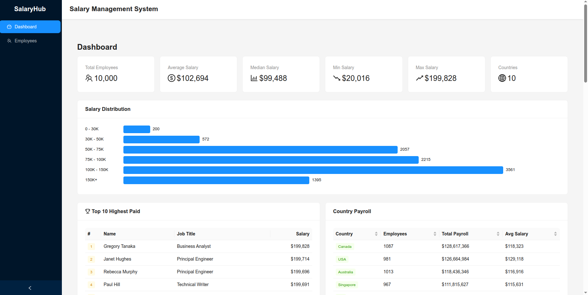
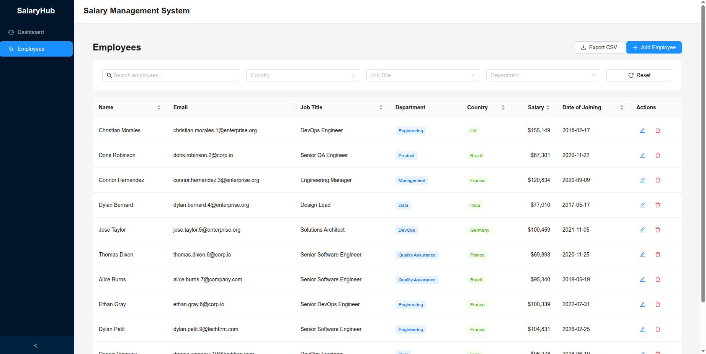

# Salary Management System

A production-quality full-stack platform for HR managers to manage employee records and gain salary insights across a workforce of 10,000+ employees. Built with a Rails API backend and React TypeScript frontend.

## Tech Stack

| Layer | Technology | Version |
|-------|-----------|---------|
| Backend Framework | Ruby on Rails (API-only) | 7.2 |
| Language (Backend) | Ruby | 3.3 |
| Frontend Framework | React | 19 |
| Frontend Language | TypeScript | 4.9 |
| UI Components | Ant Design | 6 |
| Database | SQLite | 3 |
| Backend Testing | RSpec + FactoryBot + Shoulda Matchers | 6.0 |
| Frontend Testing | Jest + React Testing Library | - |
| HTTP Client | Axios | 1.16 |

## Features

### Employee Management
- **Full CRUD** -- Create, read, update, and delete employee records
- **Search** -- Real-time search across first name, last name, and email
- **Filtering** -- Filter by country, job title, and department
- **Sorting** -- Sort by any key column (name, salary, country, job title, department, date of joining)
- **Pagination** -- Server-side pagination with configurable page size (up to 100)
- **CSV Export** -- Download filtered employee data as a CSV file

### Salary Insights Dashboard
- **Overall Statistics** -- Min, max, average, and median salary with total employee count
- **By Country** -- Salary stats grouped by country with optional country filter
- **By Job Title** -- Average, min, and max salary per job title
- **By Department** -- Salary breakdown by department
- **Salary Ranges** -- Employee distribution across salary range buckets (0-30K, 30K-50K, etc.)
- **Top Earners** -- Highest-paid employees (configurable limit, max 50)
- **Country Payroll** -- Total payroll spend per country

## Architecture

The application follows a clean architecture with separated concerns:

```
React SPA (Port 3001) ----> Rails API (Port 3000) ----> SQLite Database
```

### Backend Pattern Summary

| Pattern | Class | Responsibility |
|---------|-------|---------------|
| **Service Object** | `SalaryInsightsService` | Salary analytics computations |
| **Service Object** | `CsvExportService` | CSV generation with batch streaming |
| **Query Object** | `EmployeeQuery` | Filtering, sorting, pagination |
| **Serializer** | `EmployeeSerializer` | JSON response shaping |
| **Concern** | `Searchable` | Search scope (LIKE queries with sanitization) |
| **Concern** | `Filterable` | Filter scopes (country, job title, department) |
| **Concern** | `ErrorHandler` | Centralized exception handling (404, 422, 400) |

See [docs/ARCHITECTURE.md](docs/ARCHITECTURE.md) for detailed architecture diagrams, database schema, and API documentation.

## Getting Started

### Prerequisites
- Ruby 3.3+
- Node.js 18+
- npm 9+

### Backend Setup

```bash
bundle install
rails db:create db:migrate
rails db:seed          # Seeds 10,000 employee records (~2-3 seconds)
rails server -p 3000
```

### Frontend Setup

```bash
cd frontend
npm install
REACT_APP_API_URL=http://localhost:3000/api/v1 PORT=3001 npm start
```

Or use the Procfile to start both:

```bash
gem install foreman     # if not already installed
foreman start -f Procfile.dev
```

The frontend will be available at `http://localhost:3001` and the API at `http://localhost:3000`.

## Running Tests

### Backend (RSpec)

```bash
bundle exec rspec
```

### Frontend (Jest)

```bash
cd frontend
npm test
```

## Test Coverage

| Layer | Tests |
|-------|-------|
| Model specs | 35 |
| Request specs (Employees) | 24 |
| Request specs (Salary Insights) | 13 |
| Request specs (Exports) | 4 |
| Service specs (SalaryInsights) | 13 |
| Service specs (CsvExport) | 4 |
| Query specs (EmployeeQuery) | 13 |
| Serializer specs | 5 |
| Frontend (App + API) | 15 |
| **Total** | **126** |

## Project Structure

```
salary-management/
  app/
    controllers/
      concerns/
        error_handler.rb
      api/v1/
        employees_controller.rb
        salary_insights_controller.rb
        exports_controller.rb
    models/
      concerns/
        filterable.rb
        searchable.rb
      employee.rb
    serializers/
      employee_serializer.rb
    queries/
      employee_query.rb
    services/
      salary_insights_service.rb
      csv_export_service.rb
  config/
    routes.rb
  db/
    migrate/
    seeds.rb
    schema.rb
  spec/
    models/
    requests/
    services/
    queries/
    serializers/
    factories/
  frontend/
    src/
      components/
        EmployeeForm.tsx
      pages/
        DashboardPage.tsx
        EmployeesPage.tsx
      services/
        api.ts
      types/
        employee.ts
      App.tsx
```

## Screenshots

### Salary Insights Dashboard


### Employee Management


## Development Approach

This project was developed using **Test-Driven Development (TDD)** with the Red-Green-Refactor cycle. See [docs/TDD_APPROACH.md](docs/TDD_APPROACH.md) for details.

## Documentation

- [Architecture Overview](docs/ARCHITECTURE.md) -- System diagrams, database schema, API endpoints, performance considerations
- [Planning Notes](docs/PLANNING.md) -- Problem analysis, requirements, technical decisions, production considerations
- [TDD Approach](docs/TDD_APPROACH.md) -- Testing methodology, development cycles, coverage summary
- [AI Usage](docs/AI_USAGE.md) -- How AI tools were used during development
